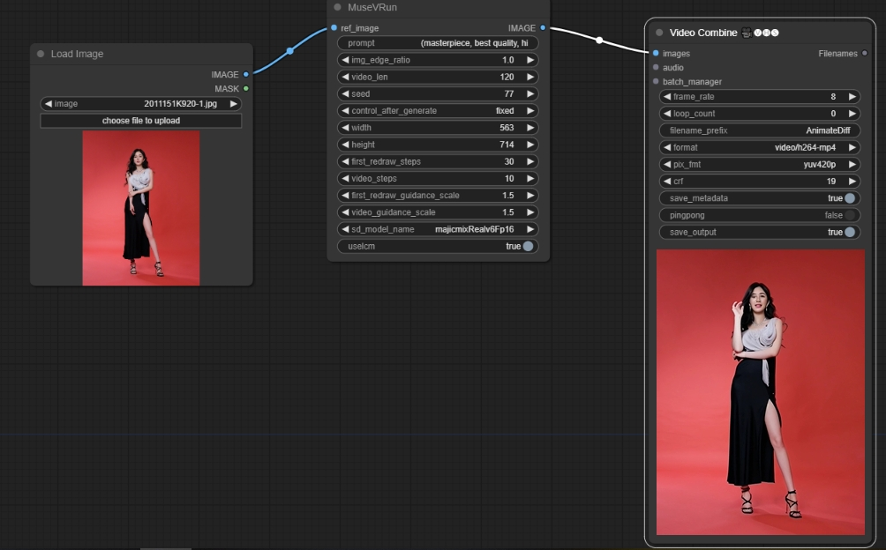

# ComfyUI-MuseV

## Install
download https://huggingface.co/TMElyralab/MuseV to ComfyUI/models/diffusers

```
huggingface-cli download --resume-download TMElyralab/MuseV --local-dir ComfyUI/models/diffusers/TMElyralab/MuseV
```

## workflow

https://github.com/chaojie/ComfyUI-MuseV/blob/main/wf.json



## [MuseV](https://github.com/TMElyralab/MuseV)